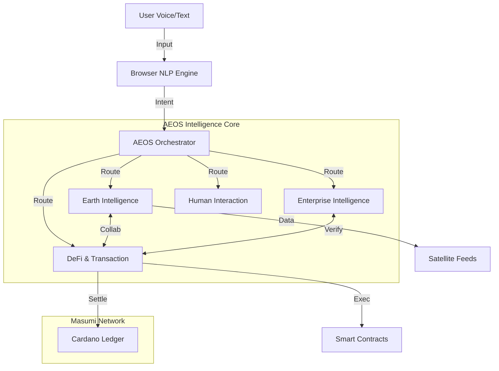

# AEOS - Autonomous Earth Operating System

## 🚀 Planetary Multi-Agent Intelligence on Masumi Network

AEOS is the world's first self-managing AI economy, designed to orchestrate both Earth-scale and Enterprise-scale automation through a unified intelligence layer.

### 🧠 The Superior AI: AEOS Orchestrator
At the core sits the **AEOS Orchestrator**, a master intelligence that:
1. **Analyzes Intent**: Deciphers complex user commands using advanced NLP.
2. **Delegates Tasks**: Routes requests to one of 4 specialized Intelligence Divisions.
3. **Manages Collaboration**: Detects when agents need to hire each other (e.g., Compliance Agent triggering a DeFi block).
4. **Optimizes Resources**: Balances computation and cost across the Masumi Network.

---

### 100+ Advanced Features & Capabilities

#### 🌍 Division 1: Earth Intelligence (EID)
*Global Risk & Planetary Monitoring*
1. **Real-time Weather Analysis**: Satellite data ingestion for localized forecasting.
2. **Climate Modeling**: Long-term trend prediction for agriculture.
3. **Disaster Prediction**: Early warning systems for floods, droughts, and fires.
4. **IoT Sensor Grid**: Direct connection to ground sensors (soil moisture, air quality).
5. **Satellite Image Processing**: Automated anomaly detection from orbital feeds.
6. **Agri-Drone Coordination**: Autonomous mission planning for crop monitoring.
7. **Water Resource Optimization**: Smart distribution logic for irrigation systems.
8. **Energy Grid Balancing**: Load forecasting for renewable energy integration.
9. **Logistics Route Optimization**: Weather-aware routing for supply chains.
10. **Natural Resource Tracking**: Monitoring deforestation and water levels.
11. **Carbon Credit Verification**: On-chain proof of sequestration.
12. **Emergency Response Triggers**: Auto-alerting rescue teams based on sensor data.
13. **Seismic Activity Monitoring**: Real-time earthquake detection.
14. **Ocean Temperature Tracking**: Marine ecosystem health analysis.
15. **Urban Air Quality Control**: Smart city integration for pollution management.
16. **Wildlife Migration Tracking**: Protecting biodiversity corridors.
17. **Harvest Yield Prediction**: AI-driven crop output estimation.
18. **Flood Barrier Automation**: Smart infrastructure control.
19. **Solar Flare Warning**: Protecting grid infrastructure from space weather.
20. **Planetary Health Dashboard**: Unified view of Earth's vital signs.

#### 🏢 Division 2: Enterprise Intelligence (ENID)
*Business Automation & Compliance*
21. **Workflow Orchestration**: End-to-end business process automation.
22. **Marketing Campaign GenAI**: Autonomous content creation and scheduling.
23. **A/B Testing Auto-Pilot**: Self-optimizing marketing strategies.
24. **Lead Scoring AI**: Predictive analytics for sales funnels.
25. **Customer Segmentation**: Dynamic clustering of user behaviors.
26. **Compliance Monitoring**: Real-time regulatory adherence checks.
27. **AML/KYC Verification**: Instant identity proofing on-chain.
28. **Smart Audit Logging**: Immutable record keeping on Cardano.
29. **Policy Enforcement**: Automated governance for DAO operations.
30. **Financial Report Generation**: AI-drafted quarterly earnings reports.
31. **Churn Prediction**: Identifying at-risk customers before they leave.
32. **Revenue Forecasting**: AI models for cash flow prediction.
33. **Fraud Detection**: Pattern recognition for anomalous transactions.
34. **Supply Chain Transparency**: Tracking provenance of goods.
35. **Contract Lifecycle Management**: Auto-renewals and expiry alerts.
36. **Employee Onboarding**: AI-guided setup for new hires.
37. **Meeting Summarization**: Auto-minutes and action item extraction.
38. **Sentiment Analysis**: Brand health monitoring across social media.
39. **Competitor Analysis**: Real-time market intelligence gathering.
40. **Data Privacy Guard**: Ensuring GDPR/CCPA compliance automatically.

#### 💸 Division 3: DeFi & Transaction (DTAD)
*Financial Operations & Risk*
41. **Yield Optimization**: Auto-rebalancing assets to highest APY pools.
42. **Smart Treasury Management**: DAO fund allocation strategies.
43. **On-Chain Insurance**: parametric insurance triggers based on EID data.
44. **Dynamic Credit Scoring**: AI-based risk assessment for borrowers.
45. **Micro-Loan Issuance**: Automated underwriting for small loans.
46. **Payment Routing**: Least-cost path finding for crypto payments.
47. **Subscription Billing**: Recurring on-chain payments.
48. **Token Swap Execution**: DEX aggregation for best prices.
49. **Liquidity Provision**: Automated market making strategies.
50. **Impermanent Loss Protection**: Hedging strategies for LPs.
51. **Wallet Security**: Multi-sig orchestration.
52. **Transaction Simulation**: Dry-run txs to prevent errors.
53. **Gas Fee Optimization**: Timing transactions for low network load.
54. **Cross-Chain Bridging**: Secure asset transfer coordination.
55. **Real-World Asset (RWA) Tokenization**: Managing digital twins of assets.
56. **Invoice Factoring**: Instant liquidity for receivables.
57. **Payroll Automation**: Streaming salaries via smart contracts.
58. **Tax Estimation**: Real-time liability tracking.
59. **Donation Transparency**: Tracking NGO funds to end recipients.
60. **Investment Portfolio GenAI**: Personalized crypto basket creation.

#### 🤝 Division 4: Human Interaction (HID)
*Support & Personalization*
61. **24/7 AI Support**: Instant resolution of user queries.
62. **Multilingual Interface**: Real-time translation of all interactions.
63. **Voice Command System**: Hands-free control of AEOS.
64. **Personalized Recommendations**: Product/Service suggestions.
65. **User Journey Mapping**: AI-optimized UX flows.
66. **Ticket Auto-Resolution**: Fixing issues without human intervention.
67. **Escalation Management**: Smart routing to human experts when needed.
68. **Sentiment-Aware Responses**: Adapting tone to user emotion.
69. **Proactive Alerts**: Notifying users before issues occur.
70. **Context Retention**: Remembering user history across sessions.
71. **Accessibility Mode**: AI-adjusted UI for different needs.
72. **Voice Biometrics**: Secure login via voiceprint.
73. **Conversational Commerce**: Buying/Selling via chat.
74. **Educational Tutors**: AI guides for learning AEOS features.
75. **Community Management**: Moderating forums and chats.
76. **Feedback Analysis**: Aggregating user suggestions.
77. **Behavioral Nudges**: Encouraging positive user actions.
78. **Virtual Concierge**: Booking and scheduling services.
79. **Gamification Engine**: Reward systems for user engagement.
80. **Privacy Controls**: User-managed data sharing settings.

#### 🔗 Masumi Network Integration (The "AI Economy")
81. **Agent-to-Agent Payments**: Agents paying each other for services.
82. **Service Discovery**: Agents finding other agents on the network.
83. **Reputation System**: On-chain scoring of agent reliability.
84. **Task Marketplace**: Bidding mechanism for complex jobs.
85. **Collaborative Workflows**: Chaining multiple agents (EID -> DTAD).
86. **Proof of Computation**: Verifying AI work was done correctly.
87. **Data Marketplace**: Selling unique datasets (e.g., weather logs).
88. **Model Licensing**: Renting fine-tuned models per inference.
89. **Decentralized ID (DID)**: Every agent has a unique on-chain identity.
90. **Smart Contract Registry**: Repository of verified agent contracts.

#### 🛡️ Security & Core OS
91. **Role-Based Access Control**: Granular permissions.
92. **End-to-End Encryption**: Secure data transit.
93. **Local NLP Processing**: Privacy-first browser intelligence.
94. **Threat Intelligence Feed**: Real-time security updates.
95. **System Health Monitoring**: Self-diagnostic capabilities.
96. **Automatic Updates**: OTA improvements for agent logic.
97. **Backup & Recovery**: Distributed state preservation.
98. **API Rate Limiting**: DDoS protection.
99. **Audit Trails**: Full history of every OS action.
100. **Dark Mode Interface**: Cyber-futuristic UI design.

---

### 🏗️ Technical Architecture

**Built with ❤️ using Lovable AI, React, Python, and Masumi Network**
